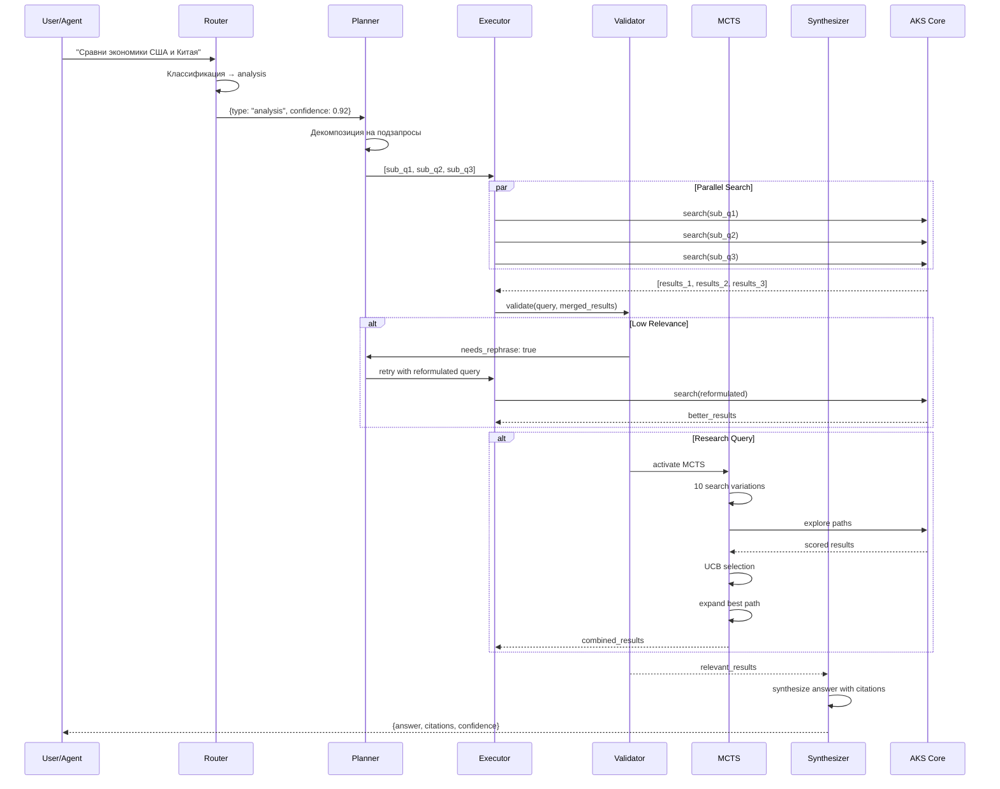
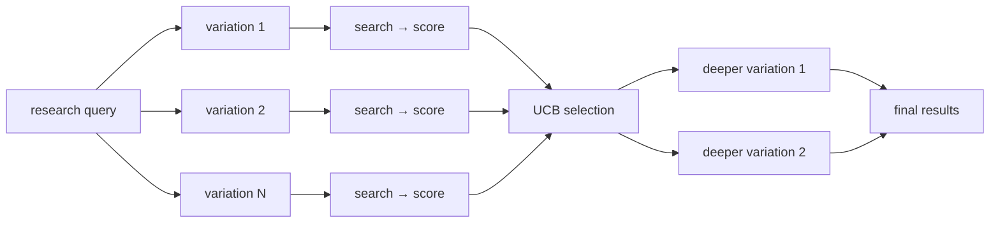

# AKS - Agentic Knowledge Systems

Это система, позволяющая быстро искать информацию в динамически меняющемся потоке данных. 

Система предоставляет возможности для быстрого поиска точечной информации на больших объёмах данных. Она глубоко нацелена на работу с ИИ агентами, но также может быть использована напрямую, как показано ниже в примере с приложением. В ней реализовано большое количество функционала: прямое цитирование моделями, обратная связь, отметки об актуальности/свежести источника, оптимизация сложных запросов и множество другого агентоориентирвоанного функционала (например, MCTS, Agentic Pipeline, SLM Router). 

Основная идея - дать ИИ агентам возможность быстро находить нужную информацию, чтобы уменьшить затраты времени, токенов и ресурсов (в ответе возвращается только запрашиваемая информация, а не весь текст документа). За счёт этого можно приблизить качество ответов SLM к LLM, имея максимальную точность и актуальность результатов. Соединение через MCP сервер с мощными агентами (Codex, Claude, Gemini) позволит существенно сократить время ответа и использующийся контекст, что в комбинации с MCTS даст возможность сделать крайне сильную систему оркестрации с самыми точными результатами. 

## Десктопное приложение

## Как верхнеуровнево работает взаимодействие агентов и поискового ядра AKS 

## Agentic Pipeline

Система автоматически определяет тип запроса и выбирает оптимальный workflow:

| Тип запроса | Пример | Workflow |
|-------------|--------|----------|
| **fact** | "Столица Франции?" | → прямой поиск |
| **analysis** | "Сравни экономики РФ и КНР" | → декомпозиция → параллельный поиск → синтез |
| **code** | "Где определена authenticate()?" | → code search → граф вызовов |
| **research** | "Комплексный анализ санкций" | → MCTS (10+ вариантов) → итеративное углубление |
| **exploration** | "Расскажи про ИИ" | → multi-search → синтез → self-consistency |

### SLM Router (Qwen-2.5-1.5B + LoRA)
- Классификация запросов на 5 типов
- Датасет: 1000 размеченных примеров
- LoRA fine-tuning через PEFT
- Эвристический fallback если SLM недоступен

### MCTS для research-запросов

## API Endpoints

### Core API
| Method | Path | Описание |
|--------|------|----------|
| `POST` | `/api/v1/search` | Гибридный поиск (dense k-NN + BM25) |
| `POST` | `/api/v1/search/multi` | Мульти-запрос с объединением результатов |
| `POST` | `/api/v1/ingest` | Асинхронная загрузка документа |
| `POST` | `/api/v1/ingest/sync` | Синхронная загрузка |
| `POST` | `/api/v1/feedback` | Обратная связь (helpful/not_helpful) |
| `GET` | `/api/v1/stats` | Статистика базы знаний |
| `POST` | `/api/v1/benchmark` | Offline-бенчмарк |

### Agentic API
| Method | Path | Описание |
|--------|------|----------|
| `POST` | `/api/v1/agentic/search` | Полный agentic pipeline |
| `POST` | `/api/v1/agentic/route` | Классификация запроса |
| `POST` | `/api/v1/agentic/fine-tune` | LoRA fine-tuning SLM |

### System
| Method | Path | Описание |
|--------|------|----------|
| `GET` | `/health/live` | Liveness probe |
| `GET` | `/health/ready` | Readiness probe |
| `GET` | `/metrics` | Prometheus metrics |
| `GET` | `/docs` | Swagger UI |
| `GET` | `/redoc` | ReDoc UI |

### Метрики

